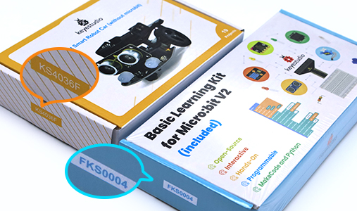

Tutorial
================================================================

.. container:: centered
            
    **Need help? Contact** support@freenove.com

.. list-table:: 
    :align: center

    * - .. centered:: SKU	
      - .. centered:: Product Name	
      - .. centered:: View on GitHub	
      - .. centered:: Download ZIP
      - .. centered:: Online

    * - .. centered:: FNK0001	
      - **Freenove Starter Kit**	
      - .. centered:: `View <https://github.com/Freenove/Freenove_Starter_Kit>`__	
      - .. centered:: `Download <https://github.com/Freenove/Freenove_Starter_Kit/archive/master.zip>`__
      -

    * - .. centered:: FNK0108
      - **Freenove Computer Case Kit Pro for Raspberry_Pi**
      - .. centered:: `View <https://github.com/Freenove/Freenove_Computer_Case_Kit_Mini_for_Raspberry_Pi>`__	
      - .. centered:: `Download <https://github.com/Freenove/Freenove_Computer_Case_Kit_Mini_for_Raspberry_Pi/archive/refs/heads/main.zip>`__
      - .. centered:: :Freenove:`Online <fnk0108>`
